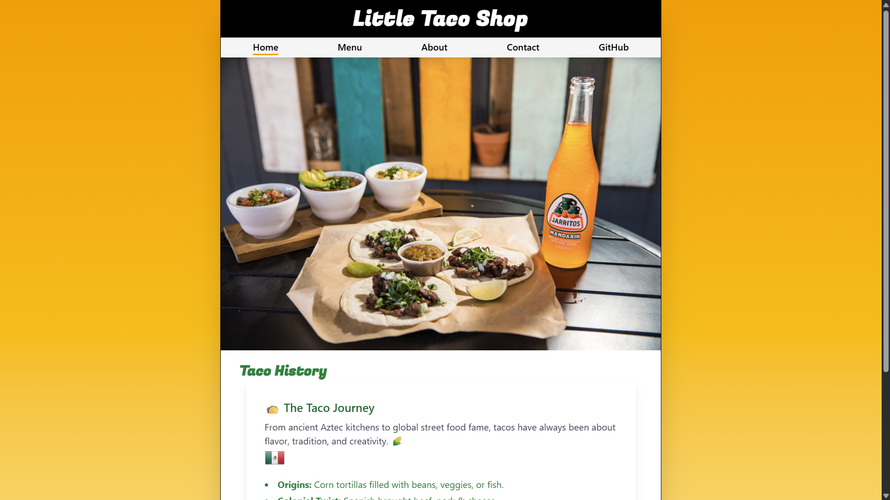

# Little Taco Shop 🌮

A modern, responsive React web application for a fictional taco restaurant. Little Taco Shop showcases a vibrant menu, engaging pages, and a delightful user experience, all styled with Tailwind CSS and powered by Vite for lightning-fast development.

## At a Glance

Take a look at the Little Taco Shop in action:


<!-- Place your screenshot at public/screenshot.png or update the path as needed -->

**Live Demo:** [View the Little Taco Shop](https://taco-heaven-79vyp55f4-prabhjot-singhs-projects-9271e357.vercel.app)
<!-- Replace with your actual deployed site link -->

## Features

- Home, Menu, About, and Contact pages
- 404 Not Found page
- Responsive design using Tailwind CSS
- Sticky footer with social links
- Routing with React Router

## Getting Started

1. **Install dependencies:**
   ```bash
   npm install
   ```

2. **Run the development server:**
   ```bash
   npm run dev
   ```

3. **Build for production:**
   ```bash
   npm run build
   ```

4. **Preview the production build:**
   ```bash
   npm run preview
   ```

## Project Structure

- `src/Components/` – React components (Footer, NotFound, etc.)
- `src/App.jsx` – Main app component and routes
- `src/index.css` – Tailwind CSS styles

## Customization

- Update menu items, branding, and content in the respective components.
- Modify Tailwind config for custom styles.

## License

MIT

---

## Original Vite + React Template Info

This template provides a minimal setup to get React working in Vite with HMR and some ESLint rules.

Currently, two official plugins are available:

- [@vitejs/plugin-react](https://github.com/vitejs/vite-plugin-react/blob/main/packages/plugin-react) uses [Babel](https://babeljs.io/) for Fast Refresh
- [@vitejs/plugin-react-swc](https://github.com/vitejs/vite-plugin-react/blob/main/packages/plugin-react-swc) uses [SWC](https://swc.rs/) for Fast Refresh

## Expanding the ESLint configuration

If you are developing a production application, we recommend using TypeScript with type-aware lint rules enabled. Check out the [TS template](https://github.com/vitejs/vite/tree/main/packages/create-vite/template-react-ts) for information on how to integrate TypeScript and [`typescript-eslint`](https://typescript-eslint.io) in your project.
